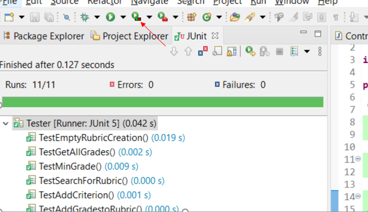
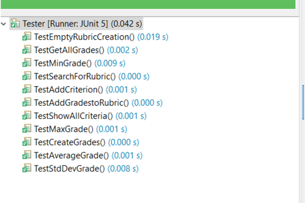
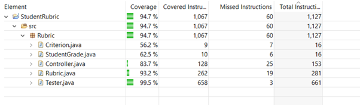
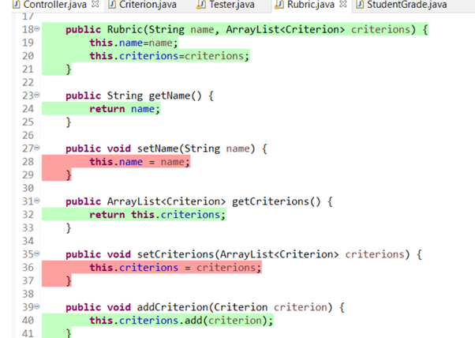

# Test Coverage Metric

The metric I used to analyse the projects test coverage was EclEmma. This is a free code coverage metric tool made specifically for Java and easily implemented through the Eclipse platform. 

It is built into Eclipse so there are no implementation steps needed. Simply, click on the run button in the eclipse menu and a report will be generated as shown below.

Clicking this button not only runs the application but pulls up the test windows applied with this metric. It generates a report on the tests and all the classes involved in the project.

All the test running in the project and the green indicating that they are passing.

This is a report on the coverage of the application that is covered with test coverage. As you can see, my application has a coverage of 94.7%. This is a high percentage to showcase that testing is showing majority of features in this project. The higher the percentage of code coverage, the less likelihood that bugs and defects will be an issue. It is recommended to have at least 85% or more coverage on your project.

Here is an example of test coverage within a specific class. Green showcases it is well covered, while red shows it is not. The EclEmma extension will highlight your code in different colours to illustrate the level of coverage.

Using Test coverage metrics is important as it helps to get a clear overview on the level of testing that has been implemented. 
