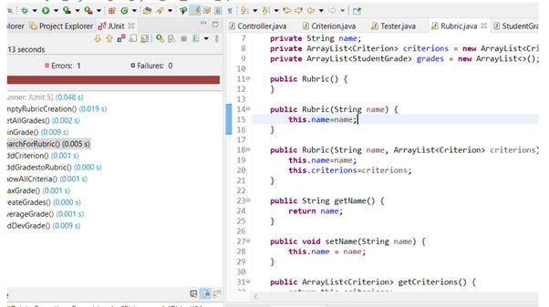

# Unit testing and Test-Driven development

Unit testing is a testing method in software development to ensure quality and minimize defects. Unit Tests are used to drive the development of the application. Unit testing’s purpose is to check all individual parts of the project are working as intended.

Test Driven Development (TDD) is a software development process where a developer would write code to be able to pass tests on the application. The process involves creating tests for features of an application to pass. If they don’t pass, you must refactor the code and run the test again. 

The Key Principle of Test-Driven Development is, **Red**, **Green**, **Refactor**.

- **Red** – Create failing tests.
- **Green** – Write code to pass the test.
- **Blue** – Refactor or change the code to be more efficient when passing. 

**RED** – Showing that a test has failed and marked where the failure has come from.

Adjust the code and then run tests again. Repeat until they pass.
Error Located in Rubric.java class.

**Green**

## Links
- [Home](README.md)

